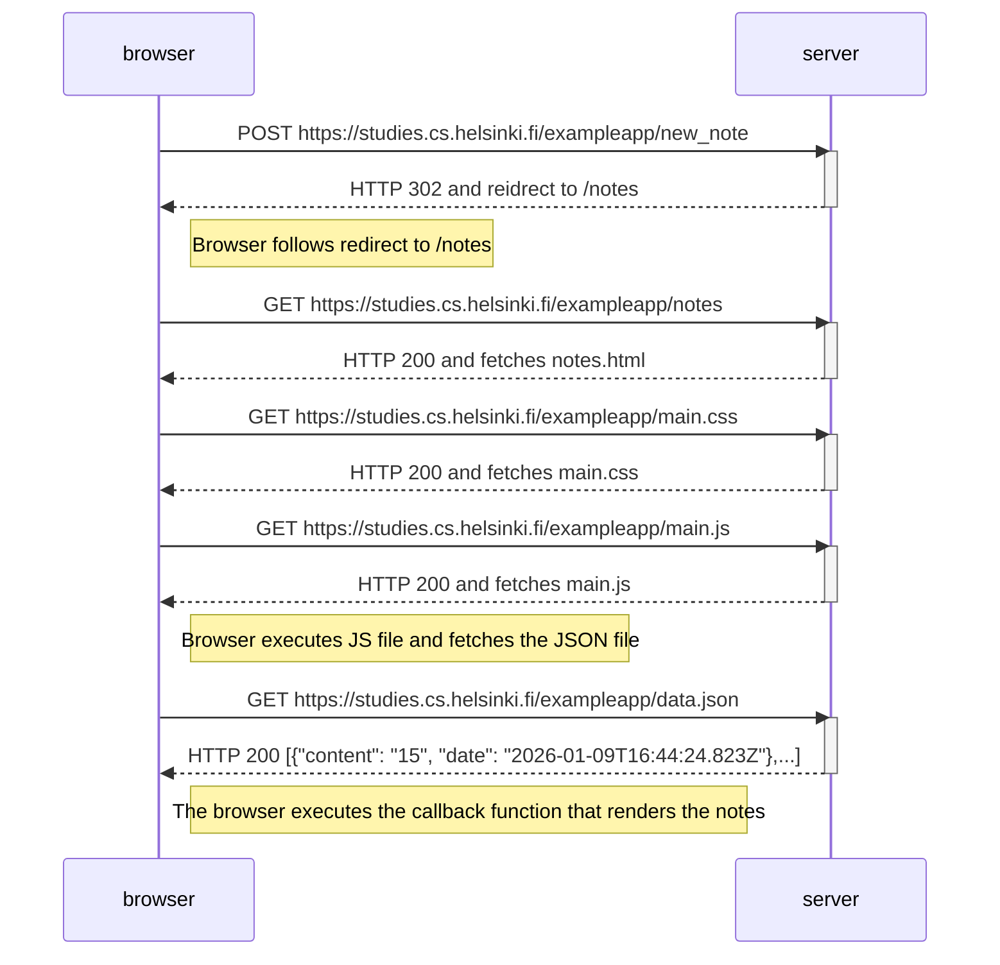

```mermaid 
sequenceDiagram
    participant browser
    participant server

browser->>server: POST https://studies.cs.helsinki.fi/exampleapp/new_note
activate server
server-->>browser: HTTP 302 and reidrect to /notes
deactivate server

Note right of browser: Browser follows redirect to /notes

browser->>server: GET https://studies.cs.helsinki.fi/exampleapp/notes
activate server
server-->>browser: HTTP 200 and fetches notes.html
deactivate server

browser->>server: GET https://studies.cs.helsinki.fi/exampleapp/main.css
activate server
server-->>browser: HTTP 200 and fetches main.css
deactivate server

browser->>server: GET https://studies.cs.helsinki.fi/exampleapp/main.js
activate server
server-->>browser: HTTP 200 and fetches main.js
deactivate server

Note right of browser: Browser executes JS file and fetches the JSON file

browser->>server: GET https://studies.cs.helsinki.fi/exampleapp/data.json
activate server
server-->>browser: HTTP 200 [{"content": "15", "date": "2026-01-09T16:44:24.823Z"},...]
deactivate server

Note right of browser: The browser executes the callback function that renders the notes
```